# Data Visualization

The [Data Visualization module](https://omeka.org/s/modules/Datavis){target=_blank} allows site administrators to generate datasets and render diagrams that reflect the complexities of their collections. Once installed and activated on the Modules section of the admin dashboard, Data Visualization is managed on a site-by-site basis. You can add your data diagrams to site pages using page blocks.

Some visualizations allow users to interact and navigate through to items or sets; others are static representations of site information. Some will require you to reformat or convert your metadata to make it readable by Data Visualization. 

All of the time- and date-based visualizations require [Numeric Data Types](numericdatatypes.md) to be installed and active on your installation, and your date values to be formatted correctly. You may also find [Data Cleaning](datacleaning.md) and [Faceted Browse](facetedbrowse.md) to be useful modules for seeing and fixing inconsistencies in your data, to make for better visualizations.

Data visualizations can be created and modified by [Global Administrators and Supervisors](../admin/users.md), and by users set to [Manager on individual sites](../sites/site_users.md). Site Creators can view visualization diagrams and datasets but not create or modify visualizations.

## Data visualizations by site

Data visualizations are generated based on the items added to a given site. You cannot visualize information about all the resources in an installation. 

A section for Data Visualization will appear in the sidebar menu for individual sites. Clicking this link will take you to a list of all visualizations created for the site. 

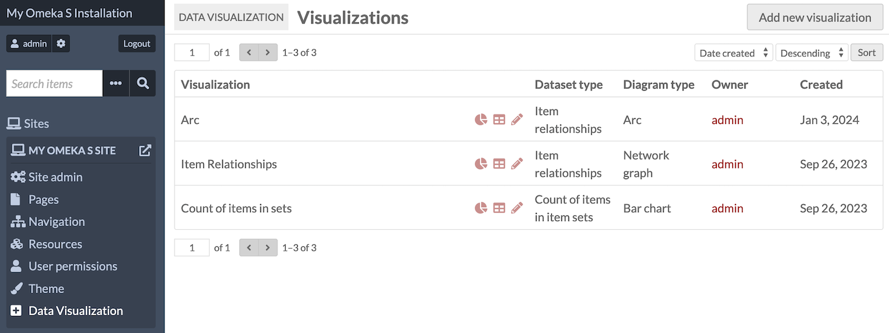

You can sort the visualizations by either date or title in ascending or descending order. You cannot batch-edit visualizations, including batch deletion, nor can you duplicate existing visualizations, or copy them to other sites.

## Add a data visualization

After clicking the Data Visualization link under a site, click the "Add new visualization" button.

You will then select what you would like to visualize. The options include:

1. **Count of items with classes**, which visualizes the count of items that are instances of selected resource classes.
1. **Count of items in item sets**, which visualizes the count of items that are assigned to selected item sets.
1. **Count of items with properties**, which visualizes the count of items that have selected properties.
1. **Count of items with property values**, which visualizes the count of items that have selected values of a selected property.
1. **County of property values**, which visualizes the count of values of a selected property.
1. **Count of items with property values in a time series**, which visualizes the count of items that have selected values of a selected property over a selected period of time.
1. **Count of items in a time series**, which visualizes the count of items over a selected period of time.
1. **Count of property values**, which visualizes the count of values of a selected property of items.
1. **Item relationships**, which visualizes the relationships between items via their resource values.

Once you select what you would like to visualize, click the "Next" button. You will then be able to describe and configure this visualization.

- Each visualization requires a Title.
- You may add a prose Description of the visualization. This will appear under the title on the visualization's page and in the page block. You can include HTML in this field, including links. 
- Use the Search Query interface to set the pool of resources to be visualized. If you choose to leave this blank, the visualization will incorporate all items assigned to that site.
    - If you select "Edit", a sidebar will open allowing you to search full-text, by value, by class, by template, by item set, and/or by owner. You can combine multiple parameters with "AND" or "OR". You can either "Preview", "Reset", or "Apply" your search by selecting the corresponding button at the bottom of the search sidebar.
    - If you select "Advanced edit", you can edit or paste in a search string from a URL (which you can create by searching your items on the site's front-end).

### Data configuration

The options for configuring your dataset will reflect the type you selected initially, and may need to be modified depending on the diagram you wish to display:

#### Count of items with classes

This selection gives you the option of a bar chart, column chart, or pie chart (see [Diagram configuration](#diagram-configuration) below).

Select the classes by clicking inside the "Classes" dropdown menu and adding available classes (see your [Vocabularies tab](../content/vocabularies.md) for installed classes) one at a time. If you do not complete this step, you will receive an error when attempting to generate your data set - you must select all classes if you wish to display them all. 

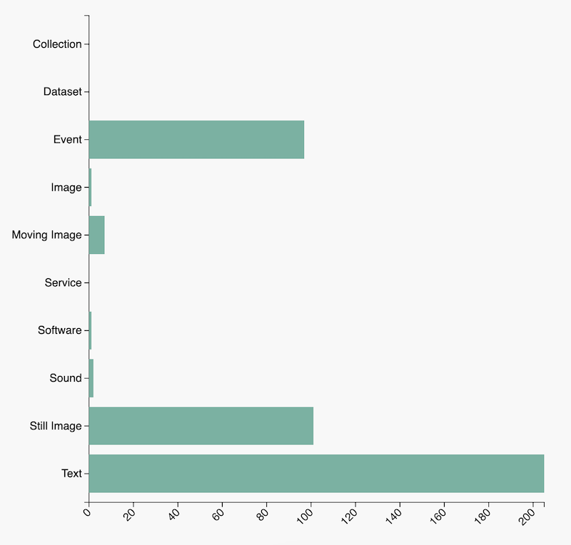

#### Count of items in item sets

This selection gives you the option of a bar chart, column chart, or pie chart.

Select one or more item sets by clicking inside the item sets box and selecting from the dropdown menu. You may add more than one item set. If you do not complete this step, you will receive an error when attempting to generate your data set - you must select all item sets if you wish to display them all.

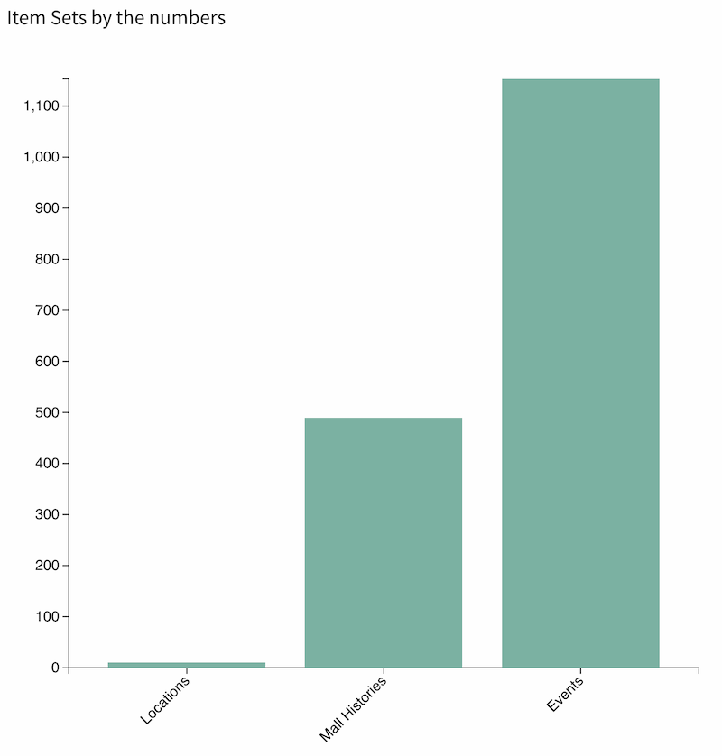

##### Count of items with properties

This selection gives you the option of a bar chart, column chart, or pie chart.

Select one or more properties by clicking inside the "Property" box and selecting from the dropdown menu. You may add more than one property. If you do not complete this step, you will receive an error when attempting to generate your data set.

#### Count of items with property values

This selection gives you the option of a bar chart, column chart, or pie chart.

There are two fields you need to complete under "Dataset configuration" when creating a count of items with properties: "Value property" and "Values". First, you must use the dropdown menu to select one property from the dropdown menu. Then, you can enter the specific values, separated by new lines, into the textbox.

You may find it useful to copy values for this list from the [Faceted Browse module](facetedbrowse.md), as it can load all available values of a given faceted property.

#### Count of items with property values in a time series

This selection will result in a line chart, and visualizes the count of items that have selected values of one property within a specified range of time. The [Numeric Data Types module](numericdatatypes.md) must be installed and activated; values used for date and time must be formatted correctly using ISO 8601 date values. 

Enter in desired values in a list. You may find it useful to copy values for this list from the [Faceted Browse module](facetedbrowse.md), as it can load all available values of a given faceted property.

Each entry in the list of values will have a separate color. The graph will display instances of each value in each "Sample rate" date bucket (e.g. each year, or each ten-year span). When a date bucket is hovered over with the mouse, a box will pop up showing precise counts of each value, in the order provided in the settings. This visualization does not provide links to items or search results. 

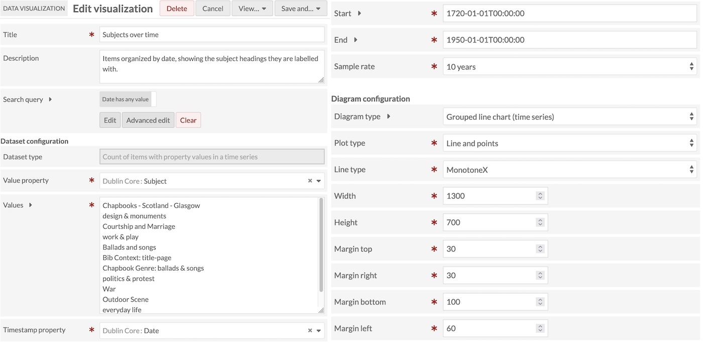

#### Count of items in a time series

This selection gives you the option of a histogram or a line chart, and visualizes the count of items over a selected period of time. The [Numeric Data Types module](numericdatatypes.md) must be installed and activated; values used for date and time must be formatted correctly using ISO 8601 date values. 

This visualization does not provide links to items included in the visualization; it only reports a count of the items inside a given bucket. 

##### Count of property values

This selection gives you the option of a bar chart, column chart, or pie chart.

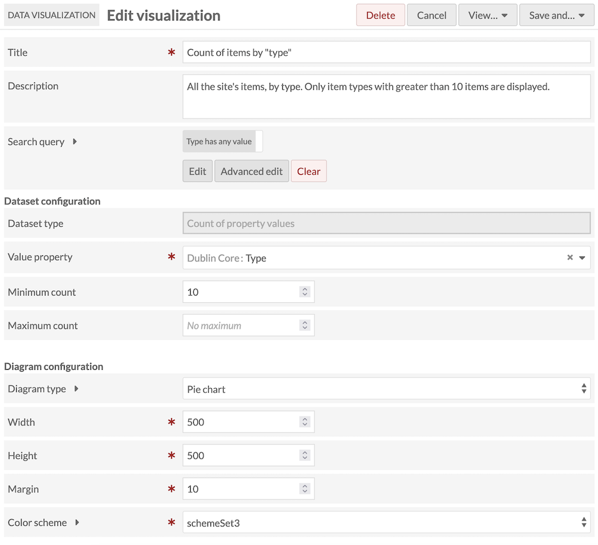

When configuring your dataset for counting property values, you must select a property from the dropdown menu. If you do not complete this step, you will receive an error when attempting to generate your dataset. There are two other optional configuration fields: Minimum count and Maximum count. You can set these values by typing or by increasing or decreasing with the arrows.

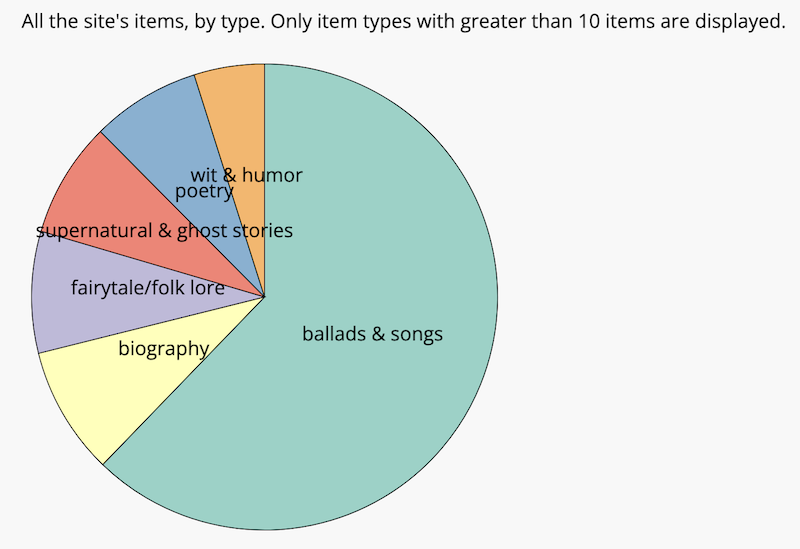

#### Item relationships

This option visualizes the relationships between items via their resource values. It relies on the [linked resources](../content/items.md#linked-resources) you have set between items using their metadata fields (e.g., setting the item "William Shakespeare" as the "Creator" value on the "Much Ado About Nothing" item). 

These visualizations will not display links between item and item sets, or links with media. 

Like other diagrams, you first choose a subset of items in the site using a search query. Then you specify which linked properties you wish to display. If you choose a certain subset of item to display (such as items with the "Person" class), the diagram will display those items' outbound links to other items in the same subset. 

You can use the properties selector to specify which links (such as "Spouse Of") to display. If you leave the properties selector blank, the diagram will display all links between the included items. 

Item relationships can be viewed in one of two diagrams: the network graph, a "tree" display with movable nodes, or the arc, with every item in one vertical list and arcs drawn between items with links. Both diagrams include pop-up boxes with more information about each item, as well as clickable links to browse those items. The following image is the arc diagram:

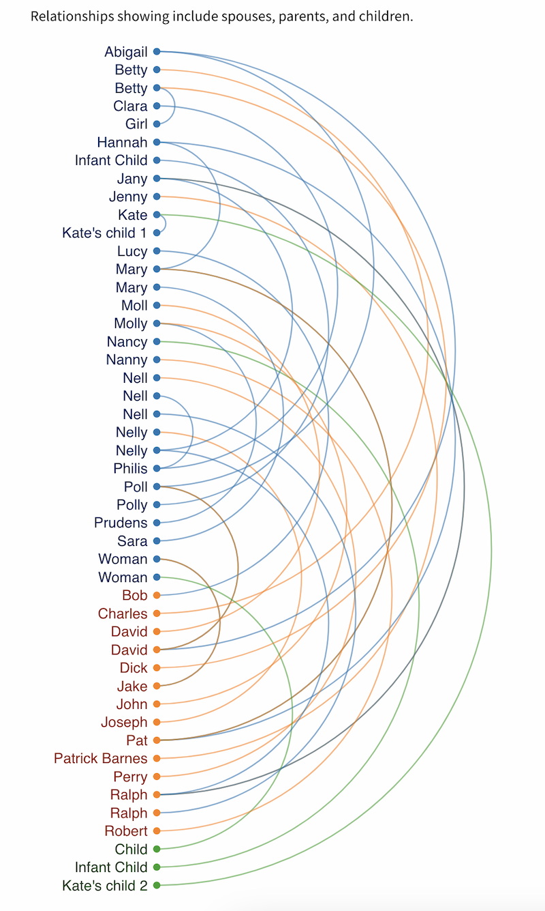

And the network graph diagram:

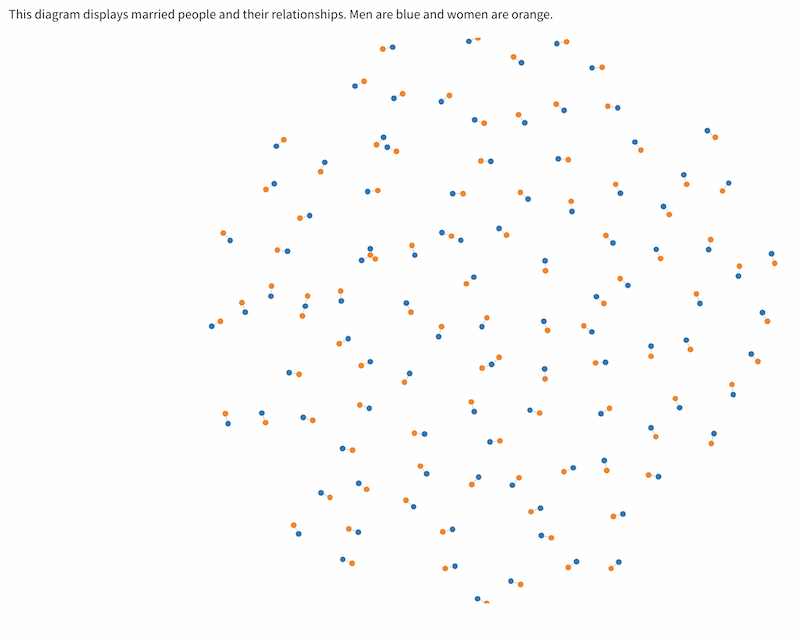

### Diagram configuration

!!! note
	If you make changes to any of the settings above this section, you will need to re-generate your dataset in order to see the results in your diagram. Changes made below this point in the configuration page do not require refreshing the dataset. However, when viewing the resulting diagram, we recommend you hard-refresh the public page to ensure changes are being loaded correctly.

Under Diagram Configuration, you will be able to select the kind of diagram you would like to produce for your visualization, then specify colors, dimensions, and other visual settings. 

#### "Count of" diagrams

For "Count of" diagrams, the options are bar chart, column chart, and pie chart.

There are no links in these diagrams that would allow users to browse the collection. 

If you select **bar chart** or **column chart**, you will be asked to input the width and height of your visualization as well as the top, right, bottom, and left margins. Additionally, you will be able to use a dropdown menu to order your data by value (ascending), by value (descending), by label (ascending), or by label (descending).

If you select **pie chart**, you will only be asked to input the width, height, and margins. Pie charts are always circles; slices are always arranged by largest to smallest, clockwise. 

The image below shows the admin screen for configuring a column chart:

For bar and column charts, you can choose a single color for the entire diagram by entering a six-digit hexadecimal color code. For pie charts, you can choose a color scheme that supplies a number of complementary colors from the dropdown. Use [the link in the help text (expanded by clicking on the arrow next to "Color scheme") to see the options](https://d3js.org/d3-scale-chromatic/categorical){target=_blank}. 

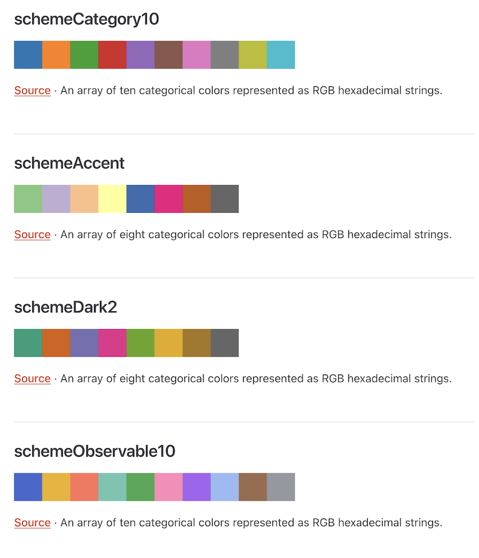

#### Date-based diagrams

##### Histograms

Histograms are available for the "Count of items in a time series" datasets. 

Histograms are similar to column charts, with the horizontal axis representing a time range and the vertical axis representing the count in your dataset. 

There are no links in this diagram that would allow users to browse the collection. 

##### Grouped line charts (time series)

Line charts are available for "Count of property values in a time series" and "Count of items in a time series" datasets. [See the screenshots above for the dataset options and diagram settings](#count-of-items-with-property-values-in-a-time-series).

Line charts are similar to column charts and histograms, with a more complex display to represent changes over time. For "Count of items in a time series," the line chart will display only one color. For "Count of property values in a time series," the line chart will display a different color for each property value included. Colors are predetermined with their display options and cannot be customized.

You can choose to display, for each value with a count: a line (with no points in each date bucket), points in each date bucket (with no connecting line), or both the line and its points.

Line options are:

- Linear
- MonotoneX
- Natural
- Step
- StepAfter
- StepBefore.

You can see the MonotoneX option in the image above, in the [Count of items with property values over time](#count-of-items-with-property-values-in-a-time-series) section. The four options below are Linear, Natural (top two), Step, and StepAfter (bottom two).

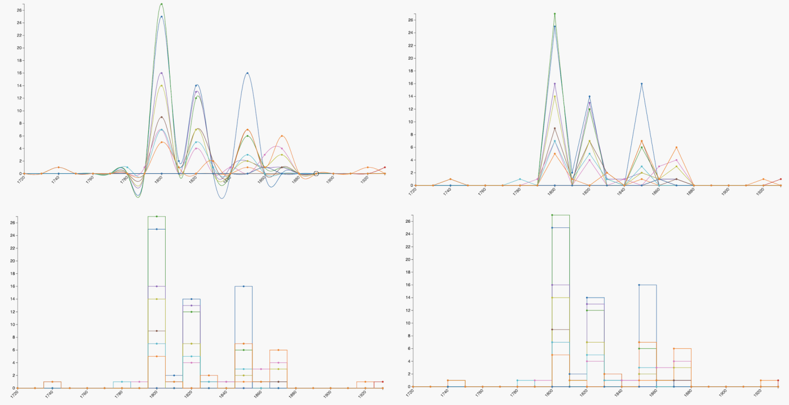

There are no links in these diagrams that would allow users to browse the collection. 

#### Relationship diagrams

##### Arc diagrams

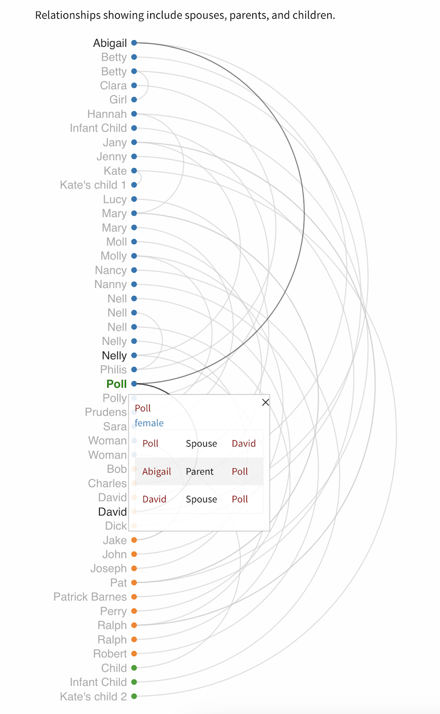

Arc diagrams display items in a column on the left-hand side of the diagram, with relationships between those items represented as large arcing semi-circles connecting two items. One item may have many arcs. 

Items are colored based on the "Group" assigned in your settings (either the item's class or template, or a property value you selected), and the arcs are the color of the item with the outbound linked resource provided in a property value.

For example, if you were showing the relationship between creators and their creations, using resource templates (e.g. "People" and "Books") as your groups, you would have people colored in orange and books colored in blue, with blue arcs connecting the books to the people provided in their "Creator" fields. If items have reciprocal (inverse) relationships with each other, you may see what looks like one arc that is the combined color of the two arcs. 

If items do not have your chosen group (e.g. if you are grouping by class and some items have no class), they will go into a "null" group. Null groups will always be displayed first.

This diagram provides links that allow users to browse the included items. 

You can set the width of the diagram; the height is set automatically by the number of items in the diagram, and the size of the text and spacing. Arcs are drawn automatically and can overflow the diagram width if you have a lot of items (and if the arc is being drawn between an item near the beginning and an item near the end of the list). 

You can also set the top and bottom margins, which is the space left above the center of the first item, and below the center of the last item. If you set these numbers to "0" you will see text cut off at the top and bottom of the diagram.

Setting the left margin means leaving space inside the diagram's total width, from the left edge, to display the item names. Because item titles can be very long, and the diagram does not add in line breaks for long labels, you may find some labels are cut off at the left side of the diagram, so set this number to compensate for the longest label in your diagram. You may also need to add width to the total diagram to accommodate this change.

You can choose to order your items by the grouping set above, or alphabetically by the item title. 

You can set the text size (from extra-extra-small to extra-extra-large) and the space between the text (in pixels). Depending on how many items are in your diagram, or the total size generated by the arcs, you may see the text size change when you modify the diagram settings. Use the "Label font size" setting to compensate for this as needed. Spacing is a numerical setting that will not be affected by other changes, but should be adjusted alongside a change to the text size. Also adjust the top and bottom margins if your text size change results in the top and bottom item labels being cut off.

You can choose a color scheme that supplies a number of complementary colors from the dropdown. Use [the link in the help text (expanded by clicking on the arrow next to "Color scheme") to see the options](https://d3js.org/d3-scale-chromatic/categorical){target=_blank}. 

##### Network graph diagrams

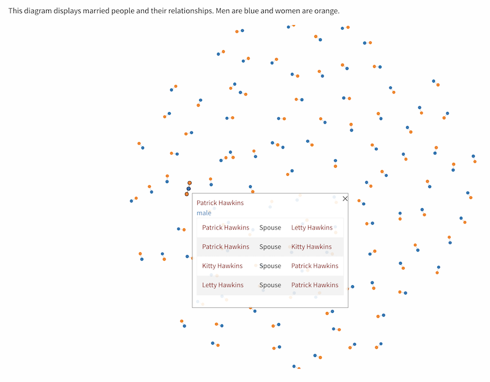

Network graph diagrams display items with links to one another in a tree visualization. 

Items are shown as small circles, and colored based on the "Group" assigned in your settings (either the item's class or template, or a property value you selected). Links between items are gray.

If items do not have your chosen group (e.g. if you are grouping by class and some items have no class), they will go into a "null" group. 

When an item is clicked, its circle will become highlighted with a black border, and its links will become black. A pop-up box will show the name of the item at the top, its group name underneath, and the linked resources that are included in the diagram. Users can drag nodes around on the screen in order to view their relationships. 

This diagram provides links that allow users to browse the included items. 

When you select a network graph diagram, you will have the options of setting a width and height for your diagram. Items will automatically cluster in a circle around the central point of your diagram, within the diameter specified by your smallest dimension, so we recommend keeping your dimensions square. 

You can choose a color scheme that supplies a number of complementary colors from the dropdown. Use [the link in the help text (expanded by clicking on the arrow next to "Color scheme") to see the options](https://d3js.org/d3-scale-chromatic/categorical){target=_blank}. 

### Generate your visualization

Once you have configured your visualization, click the "Save and..." button, select the box to "Generate dataset" and click "Stay on this visualization."

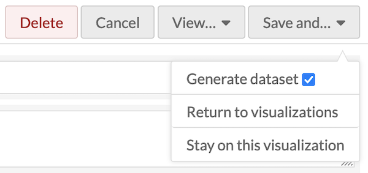

You will not see a "View" button until the dataset has finished generating. Check the job status before trying to view the results. Once your visualization is complete, you can click the "View..." button and select "Dataset" or "Diagram."

If you select "Dataset," a new browser tab will open that displays your dataset in JSON. You may find it useful to "Expand all" at the top of the page to quickly scan the loaded values.

If you select "Diagram," a new browser tab will open to a new public page on your site, containing your diagram. This page will continue to be publicly available on your site as long as the visualization exists, but you don't need to link to it from anywhere. You can insert your visualizations as page blocks instead (see below).

You can save your work and select "Return to visualizations," which will bring you to a browse list of all of your visualizations, where you can view the diagram or dataset, or edit the visualization.

If you edit your visualization to change the Diagram Configuration after your initial visualization is produced, you will lose your current diagram configuration.

You can only generate one diagram per dataset; if you wish to present multiple diagrams of the same information, create more visualizations with the same queries and settings.

### Troubleshooting

You may find that your diagram width and height does not display the results appropriately. Diagrams are generated via SVG, which means some things (such as the vertical lines in the histogram) are being drawn at narrower than 1 pixel relative to the sizes and parameters provided, or the arcs are being cut off on the right side. You can fix this by widening the diagram, narrowing the parameters on either axis (such as the date range), broadening the buckets, or reducing the number of items. Consider drawing multiple diagrams and putting them on a single page if there is too much detail to be displayed appropriately in a single diagram.

!!! note
	Your diagram should be drawn at the width and height desired in the context of the page you eventually plan to display it in. You may wish to create a draft version of the page and refresh it whenever you make changes to the diagram's settings. Some diagrams may be unsuitable depending on your page layout intended, such as intending a tall and narrow diagram displayed alongside page text. Not all diagram choices have settings that make flexible display possible.

If the text is cramped in the axes of your graph, go back and adjust the margins. Text labels do not have overflow or line-wrapping options, so some long item titles may be cut off. You can adjust the font size on some diagrams (from extra-extra-small to extra-extra-extra-large), but it may be constrained by the ultimate width of the diagram, which itself will be dependent on the layout of the page and your Omeka site's theme. 

## Publish your visualization

Data visualizations are primarily published by adding them to site pages as page blocks. 

While editing a new or existing page, add a "Data visualization" block. In the new block, use the dropdown menu to select the visualization you would like to add to the page. Then save the page edits. Remember to add the page to your site navigation, if new.

You can also use the "View diagram" buttons on each visualization to get a direct URL to a page containing the title, description, and visualization. 

You can add these pages to your site navigation under the "Navigation" settings. Look for a "Data visualization +" option in the right sidebar. 
