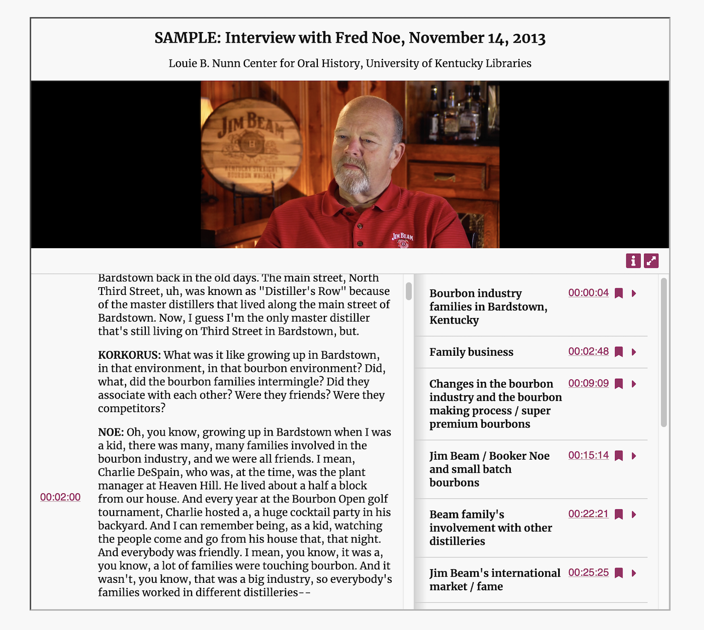
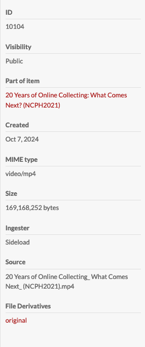
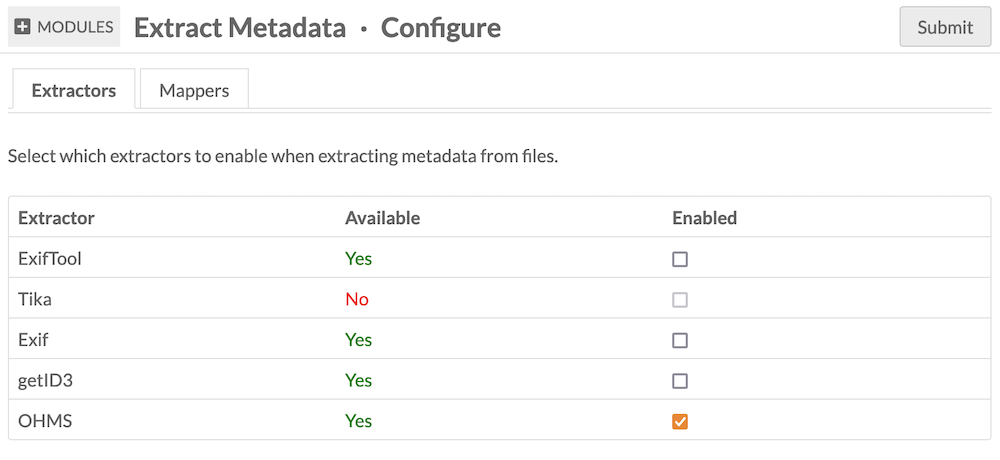
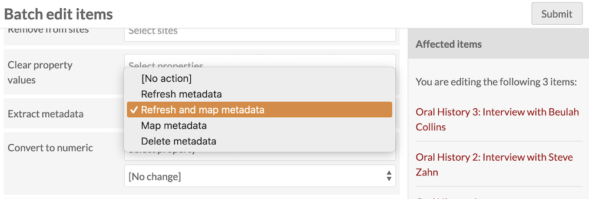
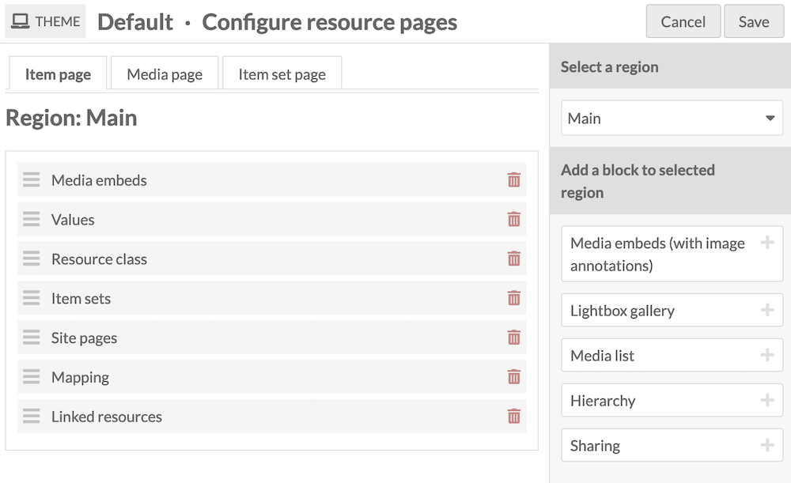

# OHMS Embed

The [OHMS Embed module](https://omeka.org/s/modules/ohmsEmbed){target=_blank} allows site administrators to add [Oral History Metadata Synchonizer](https://www.oralhistoryonline.org/){target=_blank} objects as media to Omeka S items. 

This module will add an OHMS viewer to places where media can be embedded, allowing users to view indexes, transcripts, and/or translations of videos and audio as they are played. 

OHMS XML files can be uploaded to Omeka items as media. Without this module, they will appear as attached files available for download. With this module installed and activated, they will render as video/audio displays with transcripts, indexes, etc. 

The OHMS media player can appear on item and media pages, and can be placed on Omeka site pages with the "Media embed" page block.

Preparing your Omeka installation to receive OHMS files can take some work, and includes some optional steps to enhance the process. Read over the following steps thoroughly before taking any action, so that you can set up your installation correctly based on your specific needs. 

## Create OHMS files

To create OHMS packages with your interviews, you must use the OHMS application available on the [OHMS website](https://www.oralhistoryonline.org/){target=_blank}, which requires requesting a free account and working with the web-based application. 

The OHMS application will output XML files that contain all the information created within that tool. 

Note that OHMS files include a link to the video or audio media that will be presented alongside the index and texts. They do **not** include the multimedia file itself. This must be hosted elsewhere. Your hosting options include Youtube, Vimeo, Soundcloud, and other audio/video hosting providers. 

### Host your media in Omeka (optional)

You can host your files inside your Omeka installation, as media added to items, and then provide those file URLs to the OHMS packages you generate. 

This means that you must: 

- create Omeka items by ingesting your media through either manual upload or a bulk-ingest process
- gather the URLs of your media from the Omeka server
- provide those URLs to the OHMS application
- output the XML files to be generated into Omeka
- and then append those XML files to the respective items you already created.

The advantages of this approach include simplicity of self-hosting & keeping control over your intellectual property, plus the features of Linked Data properties, data types, and controlled vocabularies you can use to add media-specific metadata right in Omeka.

Once you have uploaded your audio or video to an item, you will need to locate the direct URL of the file. Go to your item and then click on the media you'd like to use. In the description on the right side of the screen, locate the File Derivatives section. The "Original" link will be what you provide to the OHMS application. You can right-click to copy this URL.

Use Host as the Media File Host option in the OHMS editor. Input the URL for the original file in the Omeka S installation as the Media URL. 

When the oral history package is complete, export your OHMS XML file as usual.

When you return to the corresponding Omeka S item and upload the XML file as media, be sure to make the new XML file the primary media on the item.

## Add OHMS files to Omeka

The OHMS Editor produces an XML file that carries the metadata, index, and transcript that accompany the oral history. The file must be added to an Omeka S Item as media to cause the OHMS viewer to appear. 

Usually, XML is not among the allowed media types and file extensions in an Omeka S installation. You will have to enable this first. 

### Enable XML uploads

Go to your installation's Settings page, and navigate to the Security section. 

- Add `text/xml` to the **Allowed media types** list.
- Add `xml` to the **Allowed file extensions** list. 

When you are finished, click the "Save" button in the upper right hand corner of the screen.

### Configure metadata extraction (optional)

Using the [Extract Metadata](extractmetadata.md) module, you can populate the metadata fields of your Omeka items with information from the XML files - title, date, duration, source, etc. 

First, update the Extract Metadata module to version 1.2.0 or later. This will add an OHMS-specific extractor to the available tools. Navigate to your Modules page, ensure it is upgraded and activated, then click the "Configure" button. You will see a list of available extractor tools, which should include "OHMS". Check the box to ensure it is enabled, then save the page. 

Then, to map information from the XML metadata to your Omeka items, enable "JSON Pointer" on the "Mappers" tab. Then go to the "JSON Pointer crosswalk" tab to configure the metadata fields, either for the media or for the item. Extracted metadata will be generated as plain text. We advise you to view an example OHMS package and see which fields are being used. 

The following is a list of possible pointers generated by the OHMS application (be sure to include the slash in the Omeka interface):

- Record ID: `/id`
- Record date: `/dt`
- OHMS Application version: `/version`
- Interview Date: `/date`
- Date (Non-preferred format): `date_nonpreferred_format`
- CMS: `/cms_record_id`
- Title: `/title`
- Accession Number: `/accession`
- Duration: `/duration`
- Collection ID: `/collection_id`
- Collection Name: `/collection_name`
- Series ID: `/series_id`
- Series (Name): `/series_name`
- Organization: `/repository`
- Acknowledgement: `/funding`
- Organization URL: `/repository_url`
- Media file: `/file_name`
- Media ID: `/media_id`
- Media URL: `/media_url`
- Language for Translation: `/transcript_alt_lang`
- Language: `/language`
- User Notes: `/user_notes`
- Type: `/type`
- Summary: `/description`
- `/rel`
- Rights Statement: `/rights`
- Media Format: `/fmt`
- Usage Statment `/usage`
- OHMS XML Location: `/xmllocation`
- OHMS XML Filename: `/xmlfilename`
- Collection Link: `/collection_link`
- Series Link: `/series_link`
- Subject: `/subject`
- Keywords: `keyword`
- Interviewee: `interviewee`
- Interviewer: `interviewer`
- Format: `format`.

### Upload XML files

!!! note
	If you have the [Extract Text](extracttext.md) module installed, be sure to deactivate it before you upload an XML file. These files are not human-readable and their contents should not be displayed on your public pages. 

You can upload your OHMS XML files individually to items from your computer, or you can batch-import OHMS files onto new or existing items using [CSV Import](csvimport.md). 

!!! note
	Omeka S will not be able to generate an item thumbnail from OHMS files. You may want to consider adding a [custom thumbnail](https://omeka.org/s/docs/user-manual/content/items/#thumbnail) by going to the Advanced tab of the Item Edit interface.

#### Bulk-import OHMS files

If you are interested in adding many OHMS objects to your Omeka S installation at once, it is possible to use [CSV Import](csvimport.md). You can also use [File Sideload](filesideload.md) to host the XML files for ingest if needed. 

Add the XML files to your File Sideload directory or other hosting service. 

Then, create a spreadsheet that lists the URL of the files and the metadata you wish to ingest. 

If you have already created Omeka S items to host audio/video media, find a unique Omeka item identifier for attaching the respective files (such as the internal Omeka ID), and add those IDs to your spreadsheet rows. Then use the CSV Import module to [import media](https://omeka.org/s/docs/user-manual/modules/csvimport/#import-media).

If you do not already have target Omeka items, you can use CSV Import to create new items with your XML files. 

!!! note
	Note that running Extract Metadata on this bulk import, to map metadata from your XML files to your Omeka items, can be quite slow and may overload your server. You may wish to disable Extract Metadata, import your XML files first, and then bulk-refresh and map with Extract Metadata after. 

	Select multiple items on the Items browse page in the admin interface, choose "Edit selected" from the "Batch actions" dropdown, and then find the "Extract metadata" field in the options list. Select "Refresh and map metadata".

	

## Embed the OHMS viewer

Having added your OHMS XML files to you Omeka S items, you are ready to display them on your sites. 

The OHMS viewer will automatically load on resource pages (items and media) where your theme is set to display the "Media embeds" block on item pages, and the "Media render" block on media pages. 

!!! note
	The Lightbox Gallery viewer does not currently show the OHMS viewer where an OHMS XML file is detected. For OHMS to display, the "Media embeds" or "Media render" block must be used. Your site may need some reconfiguration to incorporate this smoothly, rather than including both the Lightbox and the Media blocks and having some media rendered twice. 

You can use the ["Media embed" page block](https://omeka.org/s/docs/user-manual/sites/site_pages/#media-embed) to place the OHMS viewer directly into site pages. 

You must select the XML file as the attached media - do not choose any other media, including video or audio you may have ingested to the same item. Ensure also that "Embed media" is chosen from the "Media display" dropdown.

Note that the OHMS viewer will show as a tall and narrow column if the Layout is set to "Vertical", and the full-width OHMS viewer will display if the Layout is set to "Horizontal". 

### The OHMS viewer

The Omeka S OHMS viewer has several public controls: a toggle between the index and the transcription and/or translation if those elements are available, an information icon that shows the media metadata, and an option to move to a fullscreen view.

