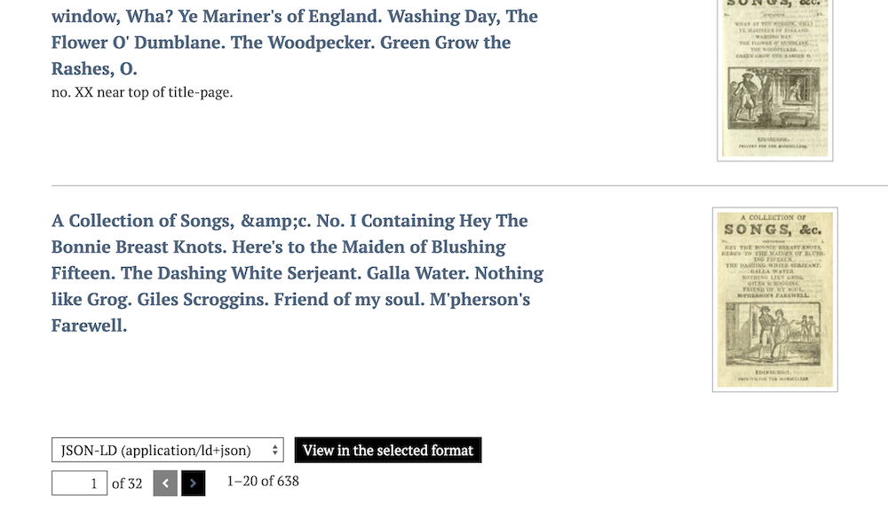
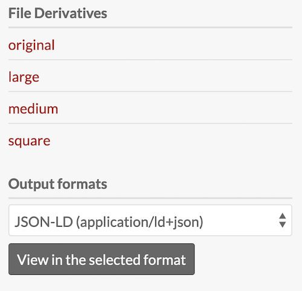
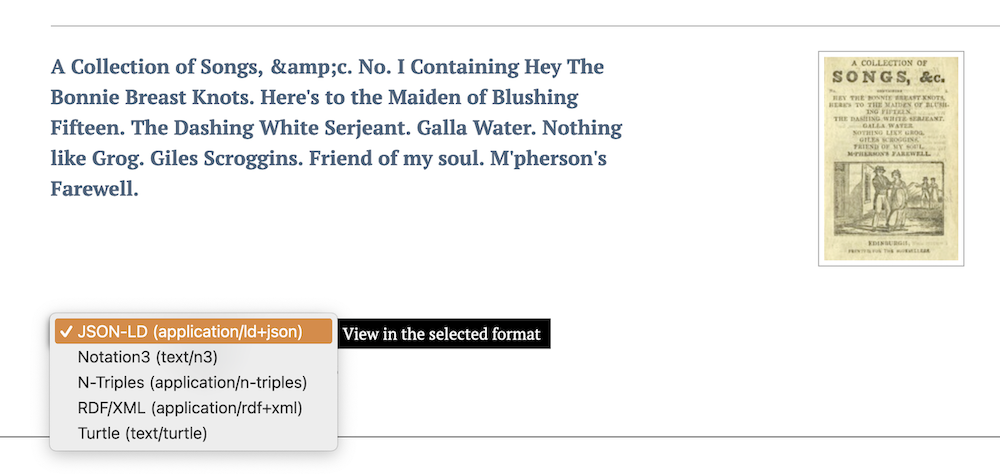

# Output Formats 

The [Output Formats module](https://omeka.org/s/modules/PersistentIdentifiers/){target=_blank} allows site administrators and/or site visitors to export datasets from the collections. Outputs are added to administrative interfaces for items, media, and item sets, and can be added to public site pages for items and item sets. 

The output formats available for this module are:

- JSON-LD
- Notation3
- N-Triples
- RDF/XML
- Turtle.

## Settings

This module has no configuration settings at an installation level. When active, it automatically appears in the following places in the administrative interfaces: at the bottom of the items browse page, media browse pages, and item set browse pages; and in the sidebar of individual item view pages, media view pages, and item set view pages. 

The module must be turned on for individual sites. To enable the format selector on a site, go to the "Site admin" page, click the "Settings" tab, look for the "Output Formats" section, and check "Add output format selector to resource pages".

When the module is enabled for a site, it will add the download options to the bottoms of browse pages and search results, and on individual item and item set view pages. The option will not be available on public media view pages.

When a site visitor, or logged-in user on an admin page, makes a selection from the dropdown on a browse page, the resulting dataset will contain one page's worth of browse/search results. The number of resources in the dataset will depend on the installation-wide pagination setting for admin pages, or the site's pagination settings for public site pages.

The options appear as follows:

- JSON-LD (application/ld+json)
- Notation3 (text/n3)
- N-Triples (application/n-triples)
- RDF/XML (application/rdf+xml)
- Turtle (text/turtle).

The button shows the text "View in the selected format".

When an output is selected, the user will either see a file available for download, or a new browser tab or window with the results.

## Issues with outputs

The crosswalking of your site's data into these formats may produce some errors. Generally, these will be compatibility issues between your resource metadata and the formats, or the tool we employ to create these formats. 

We advise administrators to test each output thoroughly and look for errors before they are discovered by the public. Then, edit resources as needed to fix the errors produced. Examples include:

- Metadata fields with strings that are too long for the output (such as the full-text capture of [Extract Text](extracttext.md)). 
- Line-break and other non-visible characters that cause issues with the selected formats.

You may also see "Maximum execution time exceeded" as an error on some formats. In this case, your server is incompatible with generating the amount of information in the given dataset. This may be fixed by lowering the number of resources showing in a page, in the site pagination settings. In some cases this issue may be unavoidable. 