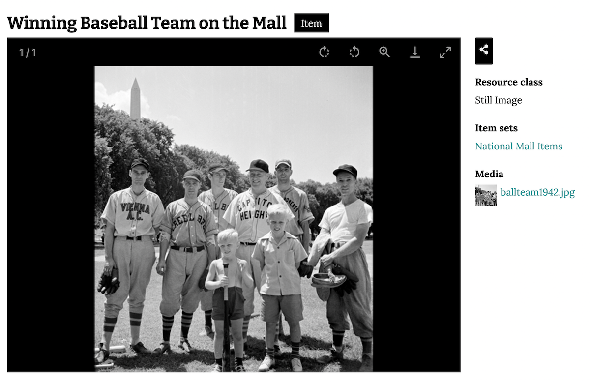
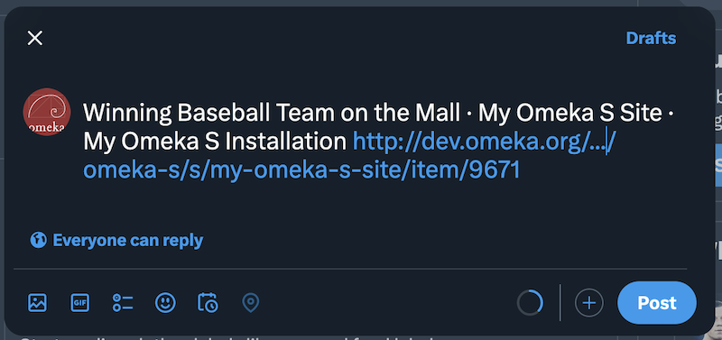

# Sharing

The [Sharing module](https://omeka.org/s/modules/Sharing){target=_blank} allows you to add buttons to site pages which visitors can use to share and embed content from your site on social media or via email. Sharing also includes [Open Graph](https://ogp.me/){target=_blank} and [oEmbed](https://oembed.com/){target=_blank} meta elements in the `<head>` of each item page on your site, so that preview cards will display when shared on social media. 

Currently, Sharing supports the following options:

- Facebook
- Twitter
- Tumblr
- Pinterest
- Email
- Embed codes.

Once Sharing has been installed and activated for an Omeka S install, it is available for all sites on the installation.

Sharing adds a new [page block](../sites/site_pages.md#page-blocks) to site pages, and a [resource block to configure](../sites/site_theme.md#configure-resource-pages) under the site theme; these blocks are optional, depending on the site settings.

## Configuration


Sharing settings are configured on a site-by-site basis. Go to a site and click through to the Site Settings. There will a section labelled "Sharing" with three options:

**Sharing buttons**: Gives a series of checkboxes, one for each service or option (Facebook, Twitter, etc.). You can uncheck all of the service boxes to turn off sharing for a single site. 

**Sharing buttons placement**: Sets the placement of the sharing buttons either at the top of the content (below the navigation and page header) or at the bottom (just above the footer). You can also choose to only display the Sharing buttons via blocks: [page blocks for individual pages](../sites/site_pages.md#page-blocks), and resource blocks set on the [resource configuation page](../sites/site_theme.md#configure-resource-pages) in the site theme. 

**Single button**: Instead of showing buttons with logos for each service selected above, show a single button with a "Share" icon that, when clicked, opens to the service options. This will replace every instance of the Sharing buttons across the entire site. 

Ensure that the correct boxes are checked for your site. Be sure to save your changes. 

### Page and resource blocks

If you have chosen to display Sharing buttons via blocks, you can configure those in two places: on each page using a page block, and on items and media under "Configure resource pages". Drop these blocks into your chosen locations. 

If you have Sharing set to "Top" or "Bottom" display on your site, you can still use the blocks. Note that this will cause the Sharing buttons to appear twice - once at the top or bottom of each page according to your settings, and again wherever the blocks are. 

### Embed elements

The module will send Open Graph and oEmbed meta tags regardless of your site settings. 

For Open Graph, this will look something like:

```
<meta property="og:site_name" content="My Omeka S Site">
```

Tags may include: 

- `og:description`, reflecting the `dcterms:description` content of any resource if applicable, or the [field used for the resource description](../content/resource-template.md#other-options)
- `og:title`, reflecting `dcterms:title` or the field used for the resource title
- `og:image`, either the primary media or the default thumbnail based on the media type
- `og:type`, always `content="website"` at this time
- `og:url`, the current page's URL.

These fields are not sent on item set or media pages. Multimedia (audio and video) will not be sent, only a thumbnail image. 

oEmbed will appear as a single tag in the `<head>` of every Omeka S public page, including items, media, and search and browse pages: 

```
<link rel="alternate" type="application/json+oembed" title="[Your page's title here]"> 
```

This element will contain an `href` value that reflects the oEmbed API for your site, found at `yourInstallationURLhere/oembed`, and the URL of the specific page of your site, something like `yourInstallationURLhere/s/site-one/item/item1`. 

## Public side

Sharing icons for enabled services and options will display on pages you build, as well as individual item pages on your site. They will not appear on pages added by modules, such as the [Map Browse page](mapping.md) or [Faceted Browse pages](facetedbrowse.md). 


Note that if you have Sharing set to "Top" or "Bottom" display on your site, and are also using the Sharing page and/or resource blocks, the Sharing buttons to appear twice - once at the top or bottom of each page according to your settings, and again wherever the blocks are. 

If you have chosen the "Single button" option, the button will display according to the theme's colours and settings. You can modify the size and colour with [CSS Editor](csseditor.md). It is shown here in the right sidebar, as a black button with a white icon, above the rest of the information:



By default, the module will share the page title, the name of the site, and the name of the installation, and then a link that viewers can click to get to the shared resource. 


